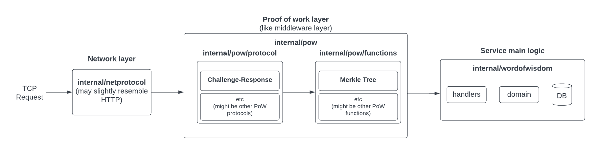

# Overview

Implementation of "Word of Wisdom" TCP server protected from DDOS attacks with the Prof of Work (challenge-response protocol used).

The general scheme with repository packages paths:

<p align="center">
  
</p>

The repository code is build in the most flexible way. It is divided into separate blocks and each block can be modified or replaced by another block. For example, `challenge-response` protocol might be replaced by `solution-verification` or you can add an implementation of [hashcash](https://en.wikipedia.org/wiki/Hashcash) to `internal/pow/functions` so that it implements the required `pow/functions` package interfaces, after that the rest of the scheme will run without changes.

## How to run

Run only server:
```
make run-server
```

Run only client:
```
make run-client
```

Client (see `cmd/client`) is an example how to interacts with the server. Currently, it connects to the server and gets wisdom quote every 5 seconds.

In addition, you can run `docker compose`:
```
make run-docker-compose
```

### Netprotocol

TCP-based protocol is designed. It may look a bit like HTTP. Clients should send a **method name** and a **body** (it might be empty) for request. 
```
<method name and newline char at the end>
<body (might be empty) and newline char at the end>
```

For example, in order to request challenge:
```
request-challenge
<empty string and \n at the end>
```

**Server response** looks like:
```
Status <status code here and \n at the end>
<response body>
```

For example, response of Merkle tree challenge:
```
Status 200
{"data":[{"data":"VoiGLOpbUOpEdKup"},{"data":"dOMeRVjaRzLNTXYe"},{"data":"UCWKsXbGyRAOmBTv"},{"data":"KSJfjzaLbtZsyMGe"}]}
```

That's data blocks generated by the server. The client should build Merkle Tree and send it to the server for verification.

Other requests might be found in `cmd/client/client.go`.

### Proof of work

[Merkle tree](https://en.wikipedia.org/wiki/Merkle_tree) is implemented as an example of PoW function. It has the following advantages:
1. implementation simplicity
2. many open source implementations (actually, my implementation inspired by [this](https://github.com/cbergoon/merkletree))
3. difficulty of hacking
4. complexity of challenge solving can be drastically increased depending on the data blocks count, because time complexity of Merkle tree building is O(2^N), where N is data blocks count. On the other hand, for verification of client's solution the server doesn't build full tree, it just checks a path from one leaf to the tree's root (time complexity O(log N)).

But as I mentioned, the project is flexible and other PoW functions can be added and used without much efforts.